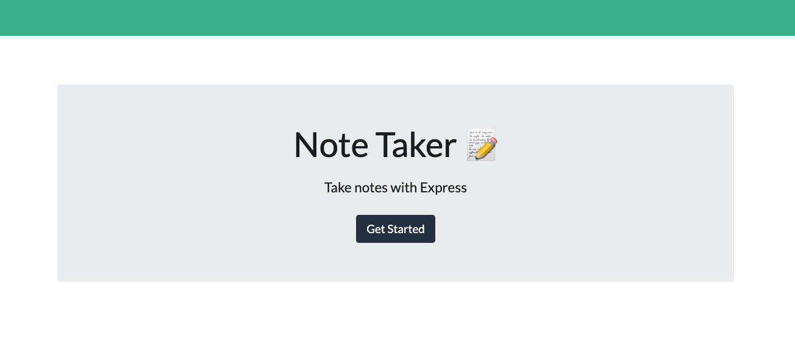

# FORGETFUL ELEPHANT NOTE TAKER APPLICATION

## Description

Built on an Express.js backend, this application allows the user to quickly store and delete notes within the browser.

## Installation

Installation is easy!  Simply copy and paste the following URL into your favorite browser:

https://argounova.github.io/initial-portfolio/

## Usage

## Credits

- Bootstrap
- Font Awesome

## License

